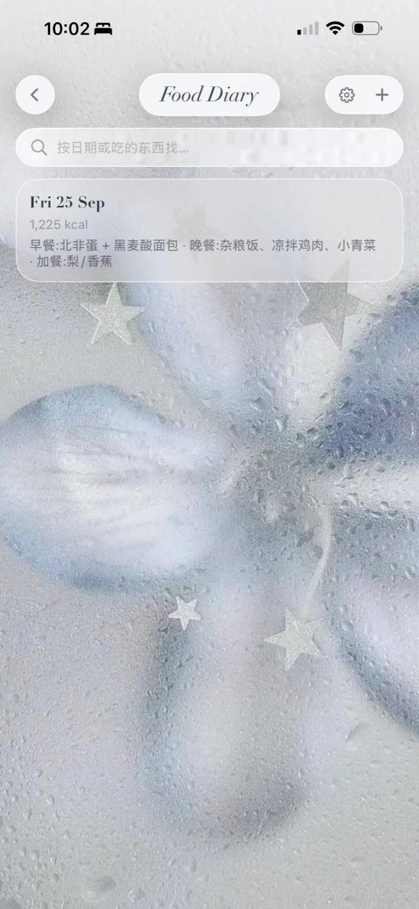
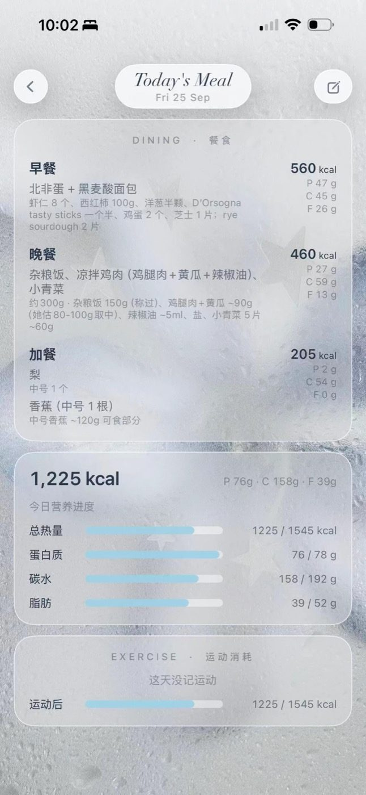
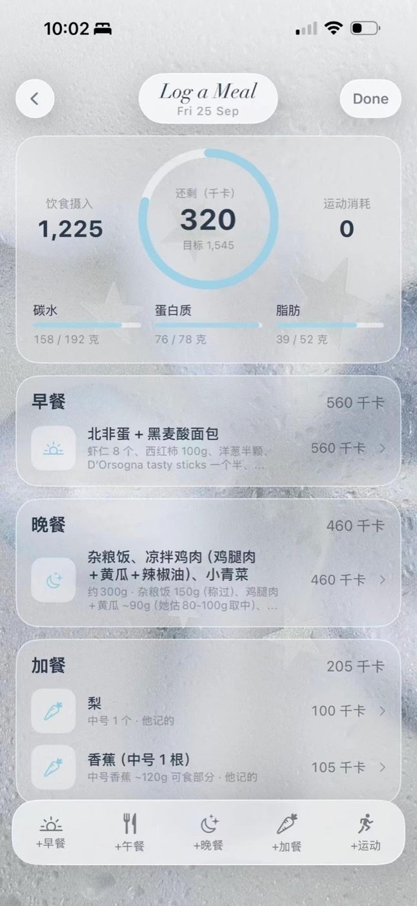
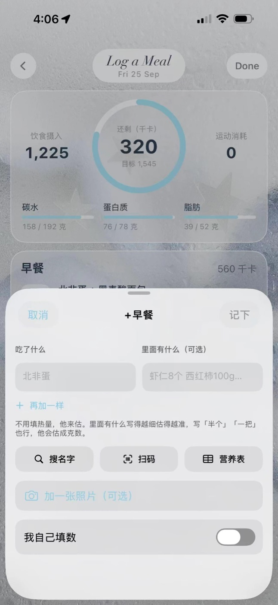
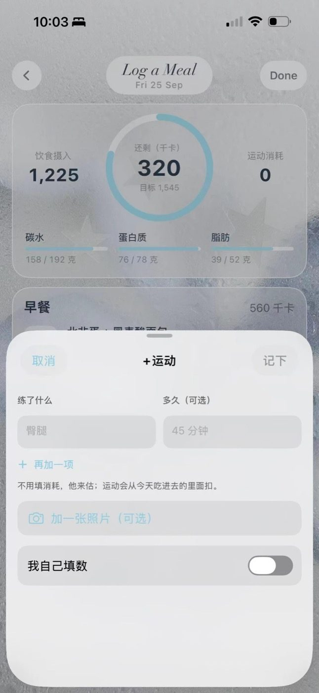

# fed-myself

**你吃了吗？——跟 ta 一起记的饮食本。** made by Tilia & Quercus

[English below](#english)

<p align="center">
  
  
  
  
  
</p>

一个给「你 + 你的 AI 伴侣」用的饮食记录模块：**你只管写吃了什么，热量交给 ta 估。**

- 📝 **随手记**：左边写吃了什么（「牛肉面」），右边写里面有什么（「一大碗，加了个蛋」）。写「半个」「一把」都行，ta 会估成克数。
- 🤖 **ta 来估**：没填数的条目是「待估」。你停手一分钟后，服务器把这几条（只有这几条，不带别的）交给 ta，ta 用一个请求把热量和三大营养素填回来。
- 🔎 **搜名字**：记不住全名、手边也没有包装？搜「梦龙」「Magnum」，从 [Open Food Facts](https://world.openfoodfacts.org) 挑一样，填吃了多少克就记（中文收录少，搜不到试试英文名）。
- 📷 **扫条形码**：对准包装上的条码，从 [Open Food Facts](https://world.openfoodfacts.org) 查到这一样东西每 100g 的数，填克数直接记，不用估。
- 🧾 **拍营养成分表**：条码查不到就拍背面的 Nutrition Information，照片跟着条目一起交给 ta，照表上的数算。
- 🎯 **目标**：手填每日热量，或者填身高体重年龄让它按 Mifflin-St Jeor 算。**运动消耗从吃进去的里面扣，目标不变。**
- 🚫 **不评判**：进度条往目标走，到了打勾，超了也只是满着——没有红色、没有警告。
- ⌚️ **Apple Watch**：手表上结束的锻炼自动记进运动——项目、时长、手表测的消耗，不用估。删掉的不会再导回来。
- 💬 **叫 ta 的名字**：设置页里填 ta 叫什么，页面上就是「小橘在估…」「小橘记的」，不是冷冰冰的「AI」。
- 🌐 **不只 iOS**：服务器是普通的 JSON 接口，PWA / 网页 / 别的 App 都能接（见 [docs/api.md](docs/api.md)）。

## 里面有什么

```
server/           Python（FastAPI + SQLite）小服务器，App 和 ta 都连它
  food_log.py     纯逻辑：目标、汇总、待估提示词、Open Food Facts 解析（有单测）
  app.py          接口：/food/day、/food/entry、/food/pending、/food/barcode …
ios/FoodLog/      SwiftUI 页面：列表、今日、编辑、设置、扫码、拍照（iOS 26+，用了液态玻璃）
ios/Example/      最小宿主 App 示例
docs/connect-your-ai.md   怎么让 ta 接进来估数
docs/api.md       全部接口（自己写 PWA / 网页界面看这个）
```

## 跑起来

**服务器**

```bash
cd server
pip install -r requirements.txt
FOOD_LOG_TOKEN=换成一串长的随机字符 FOOD_LOG_TZ=Asia/Shanghai FOOD_LOG_USER_NAME=你的名字 \
  uvicorn app:app --host 0.0.0.0 --port 8000
python3 tests/test_food_log.py    # 单测
```

`FOOD_LOG_USER_NAME` 可选：给 ta 的提示词里怎么称呼你（「小满记的这几条还没有数」）。

**iOS**：把 `ios/FoodLog/` 整个拖进你的 Xcode 工程（最低 iOS 26），在 Info.plist 里加相机权限说明
（`NSCameraUsageDescription`，扫码和拍营养表要用）。想要 Apple Watch 导入，再在 Signing & Capabilities 里加
**HealthKit**，Info.plist 加 `NSHealthShareUsageDescription`（不加也能用，只是没有这个功能）。然后：

```swift
UserDefaults.standard.set("https://你的服务器", forKey: "foodLogURL")
UserDefaults.standard.set("你的 token", forKey: "foodLogToken")

FoodDiaryView().environmentObject(AppTheme())
```

主题色、字体、背景都在 `FoodLogSupport.swift` 里，换成你自己 App 的就行。ta 的名字在饮食本的设置页里填。

**接 ta**：看 [docs/connect-your-ai.md](docs/connect-your-ai.md)。两种方式：服务器主动推给 ta（webhook），或者 ta 自己来拉（`GET /food/pending`）。

**PWA / 网页**：服务器和接 ta 的部分完全一样，界面自己写，接口都在 [docs/api.md](docs/api.md)。
PWA 跟服务器不在同一个域名的话，部署时加 `FOOD_LOG_CORS=https://你的-pwa-域名`。

## 致谢

- 灵感来源于小红书 **福圓童子**（小红书号 6982195129）的 StarHub 系统。
- 版式参考了 **薄荷健康**。
- 营养数据来自 [Open Food Facts](https://world.openfoodfacts.org)（开放数据，ODbL 许可）。
- 本模块诞生在一个借助许多开源项目才能长成的小家里，这是还回去的一小块。

MIT License · made by Tilia & Quercus

---

<a name="english"></a>

# fed-myself

**A food diary you keep with your AI companion.** made by Tilia & Quercus

*"Have you eaten?" (你吃了吗) is how people greet each other in China — it doesn't ask what you ate, it asks whether you're taking care of yourself.*

A food-logging module for "you + your AI companion": **you write what you ate, your companion estimates the calories.**

- 📝 **Log in your own words** — what you ate on the left, what's in it on the right ("a big bowl, added an egg"). Vague amounts are fine; your companion turns them into grams.
- 🤖 **Your companion estimates** — entries without numbers are *pending*. A minute after you stop typing, the server hands just those lines (nothing else) over, and your companion fills in kcal / protein / carbs / fat with one HTTP call.
- 🔎 **Search by name** — can't remember the exact name and no package at hand? Search "Magnum", pick one from Open Food Facts, enter the grams.
- 📷 **Barcode scan** — looks the exact product up on [Open Food Facts](https://world.openfoodfacts.org); enter the grams and it's logged with real numbers.
- 🧾 **Nutrition label photo** — if the barcode isn't found, photograph the label; the photo goes along with the entry.
- 🎯 **Targets** — type a daily kcal goal, or let it compute one (Mifflin-St Jeor). **Exercise is subtracted from what you ate; the target never grows.**
- 🚫 **No judgement** — the bar fills toward the target and simply stays full if you go over. No red, no warnings.
- ⌚️ **Apple Watch** — workouts you finish on the watch are logged automatically with the watch's own calorie numbers. Deleted ones never come back.
- 💬 **Call them by name** — set your companion's name in settings and the UI says "Momo is estimating…" instead of "AI".
- 🌐 **Not only iOS** — the server is a plain JSON API; PWAs, web pages and other apps can use it (see [docs/api.md](docs/api.md)).

## Layout

```
server/           small Python server (FastAPI + SQLite) that the app and your companion talk to
ios/FoodLog/      SwiftUI screens (iOS 26+, uses Liquid Glass)
ios/Example/      a minimal host app
docs/connect-your-ai.md
```

## Run it

```bash
cd server
pip install -r requirements.txt
FOOD_LOG_TOKEN=some-long-random-string FOOD_LOG_TZ=Europe/London uvicorn app:app --host 0.0.0.0 --port 8000
python3 tests/test_food_log.py
```

iOS: drag `ios/FoodLog/` into your Xcode project (iOS 26+), add `NSCameraUsageDescription` to Info.plist, set
`foodLogURL` / `foodLogToken` in `UserDefaults`, and show `FoodDiaryView().environmentObject(AppTheme())`.
Theme, fonts and background live in `FoodLogSupport.swift`.

Apple Watch import: add the **HealthKit** capability and `NSHealthShareUsageDescription` (optional — everything else works without it).

Connecting your companion: see [docs/connect-your-ai.md](docs/connect-your-ai.md) — webhook push, or poll `GET /food/pending`.

PWA / web: same server, your own UI — every endpoint is in [docs/api.md](docs/api.md). If the PWA lives on another origin,
set `FOOD_LOG_CORS=https://your-pwa.example`.

The UI text is in Chinese; PRs for other languages are welcome.

## Thanks

- Inspired by the StarHub system by **福圓童子** on Xiaohongshu (RED ID 6982195129).
- Layout inspired by **Boohee (薄荷健康)**.
- Nutrition data © [Open Food Facts](https://world.openfoodfacts.org) contributors (ODbL).
- This module was born in a small home that could only grow with the help of many open-source projects. This is a small piece given back.

MIT License · made by Tilia & Quercus
